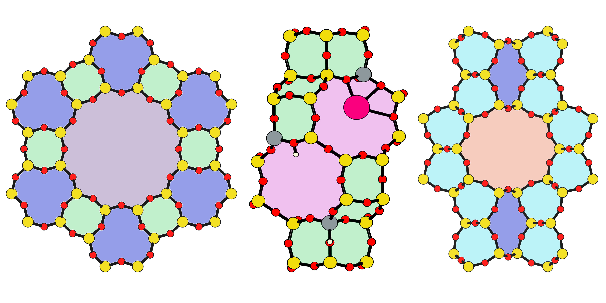

# Zeolite Simulation Environment
Authors: Jerry T. Crum, Justin R. Crum

## Description
This is a package to automate zeolite structure generation and characterization for computational chemistry.

## Requirements
This package is built around the ASE atoms object, and thus requires installation of ASE, available at: [https://wiki.fysik.dtu.dk/ase/install.html](https://wiki.fysik.dtu.dk/ase/install.html).

Ring finding uses graph theory implemented by NetworkX, available at: [https://networkx.github.io](https://networkx.github.io).

Numpy is also required.

## Installation
The package can be installed from PyPI, where it is [listed as zeose](https://pypi.org/project/zeose/), using `pip` or `uv`:
```bash
pip install
```

The other package listed on PyPI under the name `zse` is not affiliated with this package.

### Installing to contribute
Clone this git repository,

```bash
git clone https://github.com/jtcrum/zse
```

and then install it with pip:

```bash
pip install -e ./zse
```

## Current Modules
To see how to use each of the modules, please visit [examples](/examples), which contains several Python notebooks that show how to use the tools in this repository.
- `zse.cation`
- `zse.cif_tools`
- `zse.collections`
- `zse.protonate`
- `zse.rings`
- `zse.substitute`
- `zse.tpairs`
- `zse.utilities`

## Contributions
If there is something you would like to see added to this package, or if you would like to contribute, please email me at jcrum@nd.edu.

## Acknowledgments
### Contributors
Sichi Li, Craig Waitt, Yujia Wang, William Schneider, Alex Hoffman

### Testers
Jian Ren Lim, Elsa Koninckx

### Funding Sources
- [Center for Innovative and Strategic Transformation of Alkane Resources](https://cistar.us)
- [Designing Materials to Revolutionize and Engineer our Future](https://www.nsf.gov/awardsearch/showAward?AWD_ID=1922173&HistoricalAwards=false)
- [Arthur J. Schmitt Leadership Fellowship](https://graduateschool.nd.edu/graduate-training/leadership/society-of-schmitt-fellows/)

### Computational Resources
This research was supported in part by the Notre Dame [Center for Research Computing](https://docs.crc.nd.edu/index.html) through access to the HPC clusters.

### Research Group
Many thanks to all the members of the [Schneider Group](https://wfschneidergroup.github.io) who listened to me present this material over and over again, and provided input into how to make ZSE more useful.

-------

<table>
    <tr>
        <td></td>
        <td></td>
    </tr>
</table>

